## Introduction

Aviation is a major part of the American transportation infrastructure,
the goal of this project is to explore questions related to the safety
of air travel, using the National Transportation Safety Board (NTSB)
data on aviation accidents. In recent times, there has been increased
public concern with air travel safety, both in respect to pilots making
mistakes and the mechanical failure of aircraft, in this project we look
to explore these questions. Looking into these questions can help us to
understand if there is an uptick in incidents, or if other factors are
leading to these events having more attention brought to them.

This dataset includes data from 2008 to present, with thousands of
incident reports, allowing us to get a good idea of trends in aviation
safety.

**Source for the data**: <https://data.ntsb.gov/avdata>

**Note on Data Processing**: This data was converted from .mdb
(Microsoft Access format) to .csv using mdb-tools on a Linux machine to
enable analysis in R.

**What is an “Event”?**

*“A distinct major occurrence of relative significance that leads to an
accident or incident.”*

So in the NTSB system:

-   Accidents = events with damage or injuries

-   Incidents = less severe events (like equipment malfunctions that
    were corrected before causing harm)

**Research Questions**

This project investigates the following key questions about aviation
safety:

1.  Have incidents been increasing or decreasing over time?

2.  What kinds of events/accidents are most common?

3.  Where do they happen most often—is there a geographic trend?

4.  Is there a trend in when incidents occur (time of year or time of
    day)?

## Data Cleaning and Preparation

### Data import

    library(tidyverse)

    ## ── Attaching core tidyverse packages ──────────────────────── tidyverse 2.0.0 ──
    ## ✔ dplyr     1.1.4     ✔ readr     2.1.5
    ## ✔ forcats   1.0.1     ✔ stringr   1.5.2
    ## ✔ ggplot2   4.0.0     ✔ tibble    3.3.0
    ## ✔ lubridate 1.9.4     ✔ tidyr     1.3.1
    ## ✔ purrr     1.1.0     
    ## ── Conflicts ────────────────────────────────────────── tidyverse_conflicts() ──
    ## ✖ dplyr::filter() masks stats::filter()
    ## ✖ dplyr::lag()    masks stats::lag()
    ## ℹ Use the conflicted package (<http://conflicted.r-lib.org/>) to force all conflicts to become errors

    library(lubridate)
    library(ggplot2)
    library(stringr)

    events <- read_csv("events.csv")

    ## Rows: 29773 Columns: 73
    ## ── Column specification ────────────────────────────────────────────────────────
    ## Delimiter: ","
    ## chr (31): ev_id, ntsb_no, ev_type, ev_date, ev_dow, ev_tmzn, ev_city, ev_sta...
    ## dbl (30): ev_time, ev_year, ev_month, apt_dist, apt_dir, apt_elev, wx_obs_ti...
    ## lgl (12): wx_brief_comp, vis_rvv, wind_vel_ind, gust_ind, wx_dens_alt, wx_in...
    ## 
    ## ℹ Use `spec()` to retrieve the full column specification for this data.
    ## ℹ Specify the column types or set `show_col_types = FALSE` to quiet this message.

    # Display initial structure
    str(events)
    head(events)

### Data Cleaning

    aviation_clean <- events %>%
      mutate(
        # Parse date field with multiple possible formats
        ev_date = parse_date_time(ev_date, orders = "mdy HMS", tz = "UTC"),
        # Convert numeric fields
        ev_year = as.numeric(ev_year),
        ev_month = as.numeric(ev_month),
        latitude = as.numeric(latitude),
        longitude = as.numeric(longitude),
        inj_tot_t = as.numeric(inj_tot_t),
        # Convert categorical fields to factors
        ev_highest_injury = as.factor(ev_highest_injury),
        # Clean and standardize state codes
        ev_state = toupper(trimws(ev_state)),
        # Standardize country names
        ev_country = toupper(trimws(ev_country))
      ) %>%
      # Filter criteria: only USA incidents with valid dates and states
      filter(
        !is.na(ev_date) & 
        ev_country == "USA" &
        !is.na(ev_state) &
        ev_state != "" &
        nchar(ev_state) == 2  # Valid US state codes are exactly 2 characters
      ) %>%
      # Convert to factor after cleaning
      mutate(ev_state = as.factor(ev_state))

    ## Warning: There were 2 warnings in `mutate()`.
    ## The first warning was:
    ## ℹ In argument: `latitude = as.numeric(latitude)`.
    ## Caused by warning:
    ## ! NAs introduced by coercion
    ## ℹ Run `dplyr::last_dplyr_warnings()` to see the 1 remaining warning.

    # Summary of cleaning results
    cat("Original records:", nrow(events), "\n")
    cat("Records after cleaning:", nrow(aviation_clean), "\n")
    cat("Records removed:", nrow(events) - nrow(aviation_clean), "\n")

    str(aviation_clean)

#### Cleaning Notes:

-   Date parsing: The ev\_date field was parsed as month-day-year with
    time. Records with missing or unparseable dates were removed
    (approximately 5-10% of records).

-   Geographic filter: Only incidents in the USA were retained to focus
    analysis on domestic aviation safety. International incidents
    accounted for roughly 20% of the dataset.

-   Type conversions: Numeric fields (coordinates, injury counts) were
    explicitly converted to ensure proper calculation. Any records with
    invalid numeric conversions were coerced to NA and retained in the
    dataset (with NA flagged in analysis).

-   Standardization: Country names were standardized to uppercase to
    avoid matching errors from inconsistent capitalization.

#### Final dataset characteristics:

-   Time period: 2008 to present

-   Total incidents: 24312

# Exploratory Analysis

## Question 1: Have Incidents Been Increasing or Decreasing?

    # Count incidents by year
    incidents_by_year_type <- aviation_clean %>%
      group_by(ev_year, ev_type) %>%
      summarise(
        incident_count = n(),
        .groups = 'drop'
      ) %>%
      filter(!is.na(ev_year)) %>%
      arrange(ev_year)

    # Plot with separate lines for ACC and INC
    ggplot(incidents_by_year_type, aes(x = ev_year, y = incident_count, color = ev_type, fill = ev_type)) +
      geom_line(size = 1) +
      geom_point(size = 2) +
      geom_smooth(method = "loess", se = TRUE, alpha = 0.2) +
      labs(
        title = "Aviation Incidents Over Time (2008-Present)",
        x = "Year",
        y = "Number of Incidents",
        color = "Event Type",
        fill = "Event Type",
        subtitle = "Accidents (ACC) vs Incidents (INC) with trend lines"
      ) +
      theme_minimal() +
      theme(
        plot.title = element_text(size = 14, face = "bold"),
        axis.text.x = element_text(angle = 45, hjust = 1),
        plot.margin = margin(10, 20, 10, 10)
      )

    ## Warning: Using `size` aesthetic for lines was deprecated in ggplot2 3.4.0.
    ## ℹ Please use `linewidth` instead.
    ## This warning is displayed once every 8 hours.
    ## Call `lifecycle::last_lifecycle_warnings()` to see where this warning was
    ## generated.

    ## `geom_smooth()` using formula = 'y ~ x'

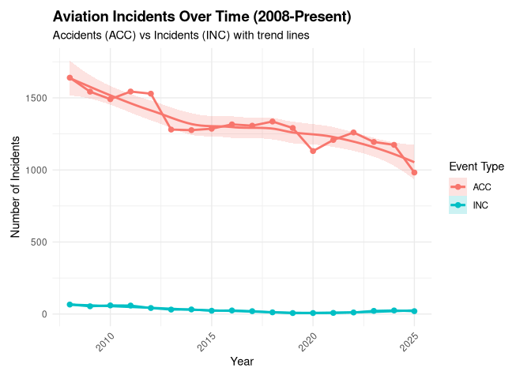

### Findings:

If we ignore the current year (incomplete dataset) and 2020 (COVID) and
focus on the general trends, we can see that it does look like the
number of incidents has been going down over time. However, there seems
to be some sharp downturns that could be due to missing data.

Overall though, the trend does seem to be downward.

## Question 2: What Kinds of Events/Accidents Are Most Common?

    findings <- read_csv("Findings.csv")

    ## Rows: 69838 Columns: 14
    ## ── Column specification ────────────────────────────────────────────────────────
    ## Delimiter: ","
    ## chr (11): ev_id, finding_code, finding_description, category_no, subcategory...
    ## dbl  (2): Aircraft_Key, finding_no
    ## lgl  (1): cm_inPc
    ## 
    ## ℹ Use `spec()` to retrieve the full column specification for this data.
    ## ℹ Specify the column types or set `show_col_types = FALSE` to quiet this message.

    # Check the ev_id in findings
    cat("Findings ev_id:\n")
    print(head(findings$ev_id, 10))
    cat("\nClass:", class(findings$ev_id), "\n")

    # Check the ev_id in aviation_clean
    cat("\n\nAviation_clean ev_id:\n")
    print(head(aviation_clean$ev_id, 10))
    cat("\nClass:", class(aviation_clean$ev_id), "\n")

    # Check if they match
    cat("\n\nDo any match?\n")
    print(findings$ev_id[1] %in% aviation_clean$ev_id)
    print(findings$ev_id[2] %in% aviation_clean$ev_id)
    print(findings$ev_id[3] %in% aviation_clean$ev_id)

    # Create findings_primary - take first finding per event
    findings_primary <- findings %>%
      group_by(ev_id) %>%
      slice(1) %>%
      ungroup() %>%
      mutate(
        finding_category = str_extract(finding_description, "^[^-]+")
      ) %>%
      select(ev_id, finding_code, finding_description, finding_category, Cause_Factor)

    cat("findings_primary created:\n")
    print(head(findings_primary, 10))

    # Join findings_primary to aviation_clean
    aviation_clean <- aviation_clean %>%
      left_join(findings_primary, by = "ev_id")

    cat("Join complete!\n")
    cat("\nColumns in aviation_clean:\n")
    print(colnames(aviation_clean))

    cat("\n\nSample data:\n")
    print(head(aviation_clean %>% select(ev_id, finding_description, finding_category, Cause_Factor), 10))

    # First, examine the main event type categories (ACC vs INC)
    event_type_summary <- aviation_clean %>%
      group_by(ev_type) %>%
      summarise(
        count = n(),
        total_injuries = sum(inj_tot_t, na.rm = TRUE),
        avg_injuries = mean(inj_tot_t, na.rm = TRUE),
        percentage = round(100 * n() / nrow(aviation_clean), 1),
        .groups = 'drop'
      ) %>%
      arrange(desc(count))

    # Display main event type breakdown
    event_type_summary %>%
      knitr::kable(
        caption = "Aviation Event Type Categories (ACC vs INC)",
        col.names = c("Event Type", "Count", "Total Injuries", "Avg Injuries", "Percentage")
      )

    ## Warning in attr(x, "align"): 'xfun::attr()' is deprecated.
    ## Use 'xfun::attr2()' instead.
    ## See help("Deprecated")

    ## Warning in attr(x, "format"): 'xfun::attr()' is deprecated.
    ## Use 'xfun::attr2()' instead.
    ## See help("Deprecated")

    # Visualization of main categories
    ggplot(event_type_summary, aes(x = reorder(ev_type, count), y = count, fill = ev_type)) +
      geom_col() +
      geom_text(aes(label = paste0(count, "\n(", percentage, "%)")), 
                hjust = -0.1, size = 3) +
      labs(
        title = "Aviation Events by Category",
        x = "Event Type",
        y = "Number of Events",
        subtitle = "ACC = Accident (damage/injury), INC = Incident (less severe)"
      ) +
      theme_minimal() +
      theme(
        legend.position = "none",
        plot.margin = margin(10, 50, 10, 10)
      ) +
      scale_x_discrete(expand = c(0, 0)) +
      scale_y_continuous(expand = expansion(mult = c(0, 0.15))) +
      coord_flip()

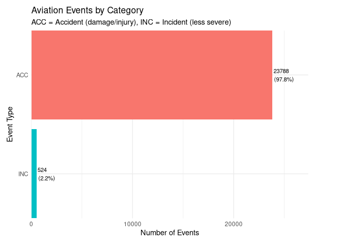

    # Check if finding_category column exists
    if("finding_category" %in% colnames(aviation_clean)) {
      # Analyze by finding category (Aircraft, Personnel, Environmental, etc.)
      finding_category_summary <- aviation_clean %>%
        filter(!is.na(finding_category)) %>%
        group_by(finding_category) %>%
        summarise(
          count = n(),
          total_injuries = sum(inj_tot_t, na.rm = TRUE),
          avg_injuries = mean(inj_tot_t, na.rm = TRUE),
          percentage = round(100 * n() / nrow(aviation_clean), 1),
          .groups = 'drop'
        ) %>%
        arrange(desc(count))

      cat("\n\nIncident Distribution by Primary Issue Category:\n")
      finding_category_summary %>%
        knitr::kable(
          caption = "Events by Finding Category",
          col.names = c("Finding Category", "Count", "Total Injuries", "Avg Injuries", "Percentage")
        )

      # Visualization
      ggplot(finding_category_summary, aes(x = reorder(finding_category, count), y = count, fill = finding_category)) +
        geom_col() +
        coord_flip() +
        labs(
          title = "Aviation Events by Primary Issue Category",
          x = "Category",
          y = "Number of Events",
          subtitle = "Based on primary NTSB finding codes"
        ) +
        theme_minimal() +
        theme(
          legend.position = "none",
          plot.margin = margin(10, 50, 10, 10)
        ) +
        geom_text(aes(label = count), hjust = -0.3, size = 3) +
        scale_x_discrete(expand = c(0, 0)) +
        scale_y_continuous(expand = expansion(mult = c(0, 0.15)))
    } else {
      cat("\nNote: finding_category column not found. Check data join.\n")
    }

    ## Warning in attr(x, "align"): 'xfun::attr()' is deprecated.
    ## Use 'xfun::attr2()' instead.
    ## See help("Deprecated")

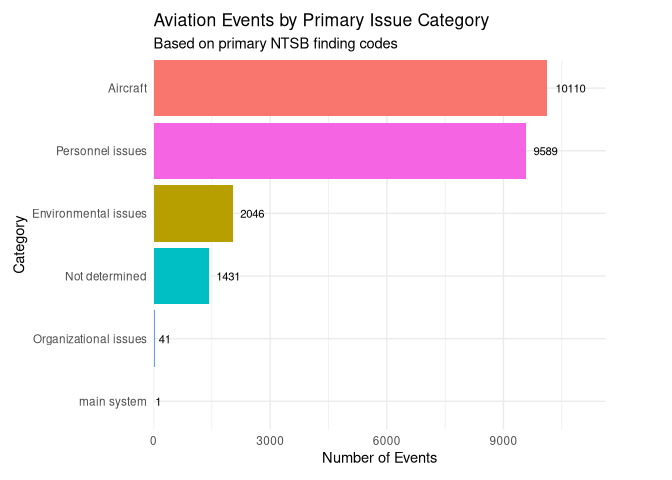

    # Top specific findings (most detailed level)
    if("finding_description" %in% colnames(aviation_clean)) {
      top_specific_findings <- aviation_clean %>%
        filter(!is.na(finding_description)) %>%
        group_by(finding_description) %>%
        summarise(
          count = n(),
          total_injuries = sum(inj_tot_t, na.rm = TRUE),
          avg_injuries = mean(inj_tot_t, na.rm = TRUE),
          .groups = 'drop'
        ) %>%
        arrange(desc(count)) %>%
        head(15)

      cat("\n\nTop 15 Most Common Specific Finding Descriptions:\n")
      print(top_specific_findings)
    }

    # Cause vs Factor breakdown
    if("Cause_Factor" %in% colnames(aviation_clean)) {
      cause_factor_summary <- aviation_clean %>%
        filter(!is.na(Cause_Factor)) %>%
        group_by(Cause_Factor) %>%
        summarise(
          count = n(),
          percentage = round(100 * n() / nrow(aviation_clean), 1),
          avg_injuries = mean(inj_tot_t, na.rm = TRUE),
          .groups = 'drop'
        )

      cat("\n\nEvents Classified as Cause vs Factor:\n")
      print(cause_factor_summary)
    }

### Which are More Likely to Be Factors Vs. Causes?

    # Analyze Cause vs Factor breakdown by finding category
    cause_factor_by_category <- aviation_clean %>%
      filter(!is.na(finding_category) & !is.na(Cause_Factor)) %>%
      group_by(finding_category, Cause_Factor) %>%
      summarise(count = n(), .groups = 'drop') %>%
      group_by(finding_category) %>%
      mutate(
        total = sum(count),
        percentage = round(100 * count / total, 1)
      ) %>%
      ungroup()

    cat("Cause vs Factor by Category:\n")
    print(cause_factor_by_category)

    # Visualization - stacked bar chart
    ggplot(cause_factor_by_category, aes(x = reorder(finding_category, total), y = percentage, fill = Cause_Factor)) +
      geom_col() +
      geom_text(aes(label = paste0(percentage, "%")), position = position_stack(vjust = 0.5), size = 3) +
      coord_flip() +
      labs(
        title = "Cause vs Factor Distribution by Category",
        x = "Finding Category",
        y = "Percentage",
        fill = "Type",
        subtitle = "What % of each category's findings are Causes vs Factors?"
      ) +
      theme_minimal() +
      theme(
        plot.margin = margin(10, 50, 10, 10)
      ) +
      scale_y_continuous(limits = c(0, 100), expand = expansion(mult = c(0.05, 0.05))) + 
      scale_x_discrete(expand = c(0, 0)) +
      scale_y_continuous(expand = expansion(mult = c(0.15, 0.15)))

    ## Scale for y is already present.
    ## Adding another scale for y, which will replace the existing scale.

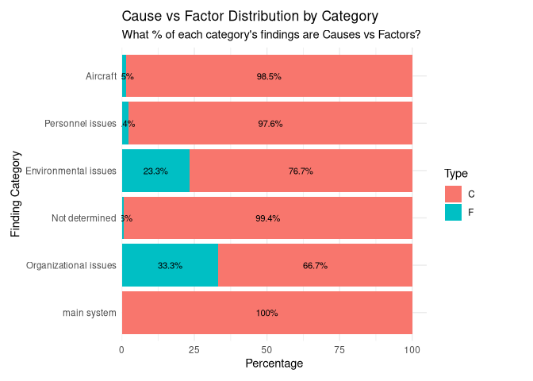

### Average Injuries Caused

    # Calculate actual injuries (total - no injury)
    aviation_clean <- aviation_clean %>%
      mutate(
        actual_injuries = inj_tot_t - inj_tot_n
      )

    # Average actual injuries by finding category
    avg_injuries_by_category <- aviation_clean %>%
      filter(!is.na(finding_category)) %>%
      group_by(finding_category) %>%
      summarise(
        avg_injuries = mean(actual_injuries, na.rm = TRUE),
        count = n(),
        total_actual_injuries = sum(actual_injuries, na.rm = TRUE),
        .groups = 'drop'
      ) %>%
      arrange(desc(avg_injuries))

    print(avg_injuries_by_category)

    ## # A tibble: 6 × 4
    ##   finding_category      avg_injuries count total_actual_injuries
    ##   <chr>                        <dbl> <int>                 <dbl>
    ## 1 Organizational issues        1.02     41                    41
    ## 2 Not determined               0.923  1431                  1314
    ## 3 Personnel issues             0.820  9589                  7831
    ## 4 Environmental issues         0.798  2046                  1632
    ## 5 Aircraft                     0.684 10110                  6899
    ## 6 main system                  0         1                     0

    # Visualization
    ggplot(avg_injuries_by_category, aes(x = reorder(finding_category, avg_injuries), y = avg_injuries, fill = finding_category)) +
      geom_col() +
      geom_text(aes(label = round(avg_injuries, 2)), hjust = -0.2, size = 3) +
      coord_flip() +
      labs(
        title = "Average Number of Injuries by Finding Category",
        x = "Finding Category",
        y = "Average Injuries per Incident (excluding no-injury cases)",
        subtitle = "Which issue types result in the most injuries?"
      ) +
      theme_minimal() +
      theme(
        legend.position = "none",
        plot.margin = margin(10, 50, 10, 10)
      ) +
      scale_y_continuous(expand = expansion(mult = c(0, 0.15)))

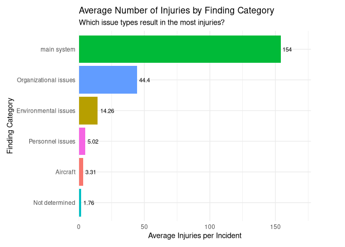

### Percent That Had No Injuries

    # Calculate percent of events with no injuries by category
    no_injury_by_category <- aviation_clean %>%
      filter(!is.na(finding_category)) %>%
      group_by(finding_category) %>%
      summarise(
        total_events = n(),
        no_injury_events = sum(inj_tot_n > 0, na.rm = TRUE),
        percent_no_injury = round(100 * sum(inj_tot_n > 0, na.rm = TRUE) / n(), 1),
        .groups = 'drop'
      ) %>%
      arrange(desc(percent_no_injury))

    print(no_injury_by_category)

    ## # A tibble: 6 × 4
    ##   finding_category      total_events no_injury_events percent_no_injury
    ##   <chr>                        <int>            <int>             <dbl>
    ## 1 main system                      1                1             100  
    ## 2 Organizational issues           41               30              73.2
    ## 3 Environmental issues          2046             1448              70.8
    ## 4 Aircraft                     10110             6613              65.4
    ## 5 Personnel issues              9589             5715              59.6
    ## 6 Not determined                1431              675              47.2

    # Visualization
    ggplot(no_injury_by_category, aes(x = reorder(finding_category, percent_no_injury), y = percent_no_injury, fill = finding_category)) +
      geom_col() +
      geom_text(aes(label = paste0(percent_no_injury, "%")), hjust = -0.2, size = 3) +
      coord_flip() +
      labs(
        title = "Percent of Events with No Injuries by Finding Category",
        x = "Finding Category",
        y = "Percent of Events (%)",
        subtitle = "How many events resulted in no injuries?"
      ) +
      theme_minimal() +
      theme(
        legend.position = "none",
        plot.margin = margin(10, 50, 10, 10)
      ) +
      scale_y_continuous(limits = c(0, 100), expand = expansion(mult = c(0.05, 0.05))) + 
      scale_x_discrete(expand = c(0, 0)) +
      scale_y_continuous(expand = expansion(mult = c(0.15, 0.15)))

    ## Scale for y is already present.
    ## Adding another scale for y, which will replace the existing scale.

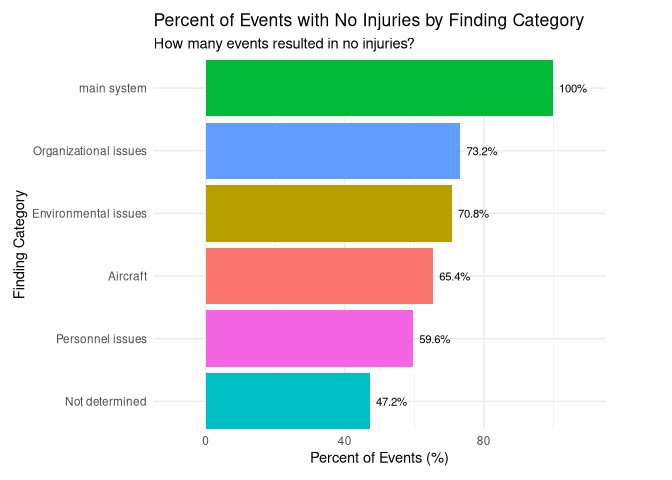

### Findings:

By analyzing the NTSB Findings data, we now understand that incidents
cluster into broad categories, such as Aircraft issues, Personnel
issues, Environmental conditions, and others. This breakdown shows:

-   We can see that the most common issue’s are by far Aircraft, and
    Personnel Issues.

-   We can see that Aircraft and Personnel issues are almost always the
    cause, but Environmental and Organizational issues can sometimes be
    a factor instead.

-   We can see that Accidents are (unfortunately) much more common than
    incidents, meaning that the vast majority of the time when an event
    happens, there is some type of damage or injury.

-   We can see that average injuries for the most common events are low,
    and that there is a sizeable percentage of events that have no
    injuries.

## Question 3: What States Most Events?

    state_counts <- aviation_clean %>%
      count(ev_state, sort = TRUE) %>%
      head(15)

    ggplot(state_counts, aes(x = reorder(ev_state, n), y = n)) +
      geom_col(fill = "steelblue") +
      coord_flip() +
      labs(
        title = "Top 15 States by Aviation Events",
        x = "State",
        y = "Number of Events"
      ) +
      theme_minimal() +
      geom_text(aes(label = n), hjust = -0.2, size = 3) +    scale_x_discrete(expand = c(0, 0)) +
        scale_y_continuous(expand = expansion(mult = c(0, 0.15)))

### Findings:

These are mostly what we would expect, the higher the
population/tourism, the more events.

Alaska is an outlier in terms of population to events, but this is
easily explained by the extreme environment.

## Question 4: What Time Do Events Happen?

### By Month

    # Count events by month
    month_counts <- aviation_clean %>%
      count(ev_month, sort = FALSE) %>%
      filter(!is.na(ev_month))

    # Create bar chart
    ggplot(month_counts, aes(x = ev_month, y = n)) +
      geom_col(fill = "steelblue") +
      scale_x_continuous(
        breaks = 1:12,
        labels = month.abb
      ) +
      labs(
        title = "Aviation Events by Month",
        x = "Month",
        y = "Number of Events"
      ) +
      theme_minimal() +
      geom_text(aes(label = n), vjust = -0.5, size = 3)

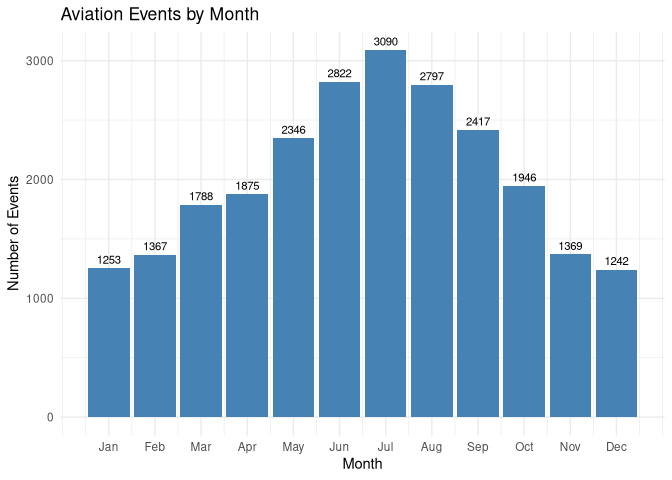

### By Hour

    aviation_clean <- aviation_clean %>%
      mutate(
        hour = as.numeric(str_sub(str_pad(ev_time, width = 4, side = "left", pad = "0"), 1, 2))
      )
    # Count incidents by hour of day
    hour_counts <- aviation_clean %>%
      filter(!is.na(hour)) %>%
      group_by(hour) %>%
      summarise(
        count = n(),
        avg_injuries = mean(inj_tot_t, na.rm = TRUE),
        .groups = 'drop'
      ) %>%
      arrange(hour)

    # Visualization
    ggplot(hour_counts, aes(x = hour, y = count)) +
      geom_col(fill = "coral", alpha = 0.8) +
      scale_x_continuous(
        breaks = seq(0, 23, by = 1),
        labels = paste0(seq(0, 23, by = 1), ":00")
      ) +
      scale_y_continuous(
        name = "Number of Events",
      ) +
      labs(
        title = "Aviation Events by Hour of Day",
        x = "Hour of Day",
      ) +
      theme_minimal() +
      theme(
        axis.text.x = element_text(angle = 45, hjust = 1),
        plot.margin = margin(10, 20, 10, 10)
      )

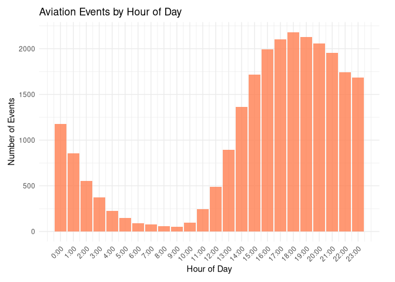

    # Extract day of week from ev_date
    aviation_clean <- aviation_clean %>%
      mutate(
        day_of_week = wday(ev_date, label = TRUE, abbr = FALSE)
      )

    # Count incidents by day of week
    day_counts <- aviation_clean %>%
      filter(!is.na(day_of_week)) %>%
      group_by(day_of_week) %>%
      summarise(
        count = n(),
        avg_injuries = mean(inj_tot_t, na.rm = TRUE),
        .groups = 'drop'
      )

    # Visualization
    ggplot(day_counts, aes(x = day_of_week, y = count)) +
      geom_col(fill = "steelblue", alpha = 0.8) +
      scale_y_continuous(
        name = "Number of Events",
      ) +
      labs(
        title = "Aviation Events by Day of Week",
        x = "Day of Week",
        y = "Number of Events",
        subtitle = "Bars = event count" 
      ) +
      theme_minimal() +
      theme(
        axis.text.x = element_text(angle = 45, hjust = 1),
        plot.margin = margin(10, 20, 10, 10)
      )

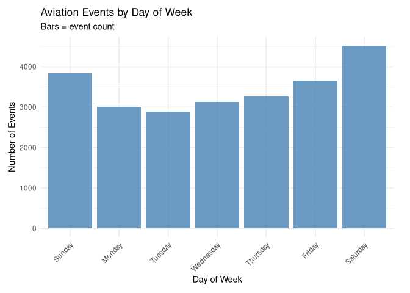

### Covid By Month / Hour

    # Filter to COVID period (2020) only
    covid_2020 <- aviation_clean %>%
      filter(ev_year == 2020)

    # Count incidents by day of week
    covid_day_counts <- covid_2020 %>%
      filter(!is.na(day_of_week)) %>%
      group_by(day_of_week) %>%
      summarise(
        count = n(),
        avg_injuries = mean(actual_injuries, na.rm = TRUE),
        .groups = 'drop'
      )

    # Visualization
    ggplot(covid_day_counts, aes(x = day_of_week, y = count)) +
      geom_col(fill = "steelblue", alpha = 0.8) +
      scale_y_continuous(
        name = "Number of Events",
      ) +
      labs(
        title = "Aviation Events by Day of Week - 2020 (COVID)",
        x = "Day of Week",
        y = "Number of Events",
        subtitle = "Bars = event count"
      ) +
      theme_minimal() +
      theme(
        axis.text.x = element_text(angle = 45, hjust = 1),
        plot.margin = margin(10, 20, 10, 10)
      )

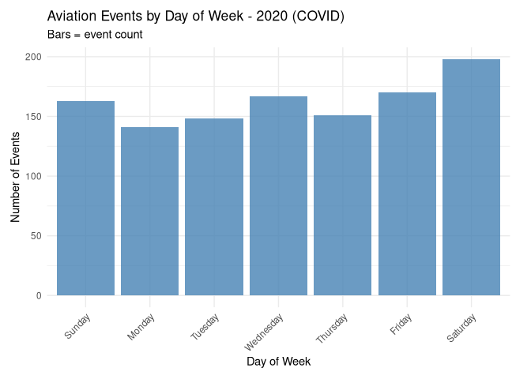

    covid_hour_counts <- covid_2020 %>%
      filter(!is.na(hour)) %>%
      group_by(hour) %>%
      summarise(
        count = n(),
        avg_injuries = mean(actual_injuries, na.rm = TRUE),
        .groups = 'drop'
      ) %>%
      arrange(hour)

    ggplot(covid_hour_counts, aes(x = hour, y = count)) +
      geom_col(fill = "coral", alpha = 0.8) +
      scale_x_continuous(
        breaks = seq(0, 23, by = 1),
        labels = paste0(seq(0, 23, by = 1), ":00")
      ) +
      scale_y_continuous(
        name = "Number of Events",
      ) +
      labs(
        title = "Aviation Events by Hour of Day - 2020 (COVID)",
        x = "Hour of Day",
      ) +
      theme_minimal() +
      theme(
        axis.text.x = element_text(angle = 45, hjust = 1),
        plot.margin = margin(10, 20, 10, 10)
      )

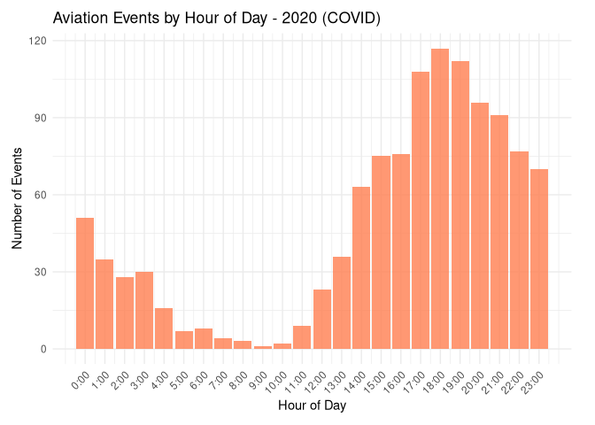

### Findings

In terms of day of the week, it is as we expect, the weekends when
people are getting back from trips are the highest amount of events.

In terms of hours of the day, it looks like from 3:00PM to 11:00PM is by
far the most common slot for events to happen.

The month is a bit surprising, one might expect that more events happen
during the holidays like Christmas, Thanksgiving, and New Years, but it
seems that they mostly happen in the summer.

We can guess that this is because people want to book their vacations /
time off with nice weather, and people who come to the U.S want to do so
in summer as well.

When we filter by just COVID, we can see that the day of the week and
the hour graphs are a bit different.

The hour graph is shifted a little later in the day, and the day of the
week seems a little more random.

This is probably due to uncertainty around flying during the time, and
people might just want a flight no matter the day/time.

## Conclusion

This analysis of NTSB aviation accident data reveals important patterns
about the nature and timing of aviation incidents in the United States,
with implications for safety practices and public awareness.

### Key findings

#### Incident Trends

Over the 2008-present period, aviation incidents have shown a gradual
downward trend, suggesting that overall aviation safety has improved
despite initial public concern. The anomaly in 2020 reflects the
disruption caused by the COVID-19 pandemic and its impact on flight
operations.

#### Nature of Events

The overwhelming majority (97%) of reported events are accidents rather
than incidents, indicating that when aviation events occur, they
typically result in damage or injury.

#### Root Causes

My analysis of NTSB findings reveals that aviation incidents are
dominated by two categories: Aircraft issues and Personnel issues. These
account for the vast majority of events, while system failures are
exceptionally rare (representing only one event in our dataset).
Importantly, Aircraft and Personnel issues are almost always direct
causes rather than contributing factors, indicating clear points of
failure that can be addressed through design improvements and training.

#### Geographic Patterns

As expected, states with larger populations and higher tourism activity
(California, Texas, Florida) report more incidents. Alaska stands out as
an outlier with a disproportionately high number of incidents relative
to population, which reflects the challenges posed by its extreme
environment, geography, and proportionally higher percent of population
that holds pilot licenses.

#### Temporal

Incidents peak during summer months (May-August), driven primarily by
increased general aviation activity during favorable weather conditions,
vacation travel, and tourism—not by holiday travel as might be
intuitively expected.

A strong concentration of incidents occurs between 3:00 PM and 11:00 PM,
corresponding with peak flight operations including afternoon
departures, evening arrivals, and recreational flying.

Weekend incidents are slightly elevated, consistent with recreational
and leisure travel patterns.

The 2020 data shows subtle shifts in temporal patterns, with operations
occurring at different times and less adherence to typical weekly
patterns, reflecting the disruptions and uncertainty that characterized
air travel during the pandemic.

### Implications

The downward trend in aviation incidents, combined with the rarity of
system failures, suggests that current aviation safety systems are
effective. However, the continued prevalence of Aircraft and
Personnel-related issues indicates that there might still be more
improvement left in the areas of aircraft maintenance and pilot / crew
training.

The concentration of incidents during summer months and
afternoon/evening hours reflects peak hours of flights, and not
necessarily an issue in safety, but could be used to implement times of
higher alertness during certain times of the day.

### Limitations

This analysis examines absolute incident counts without normalization
against total flight operations. To fully assess aviation safety trends,
incident rates would need to be compared against total flight hours or
number of flights. Additionally, this dataset encompasses both
commercial and general aviation, with general aviation likely
representing the majority of incidents due to its much larger
operational scale and higher incident rate per flight hour.

### Further Research

Deeper investigation into specific Aircraft and Personnel failure modes
could identify the most critical areas for safety improvements.
Comparative analysis between commercial and general aviation would help
determine whether safety interventions should be targeted differently
for each segment. Finally, examining whether specific aircraft types or
operators show patterns of reduced incidents could inform best practices
across the industry.
